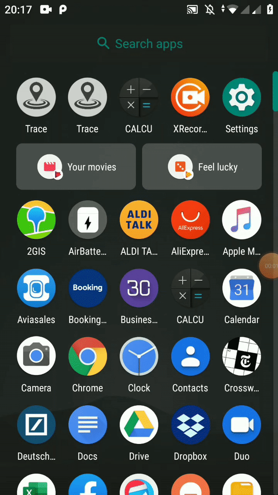
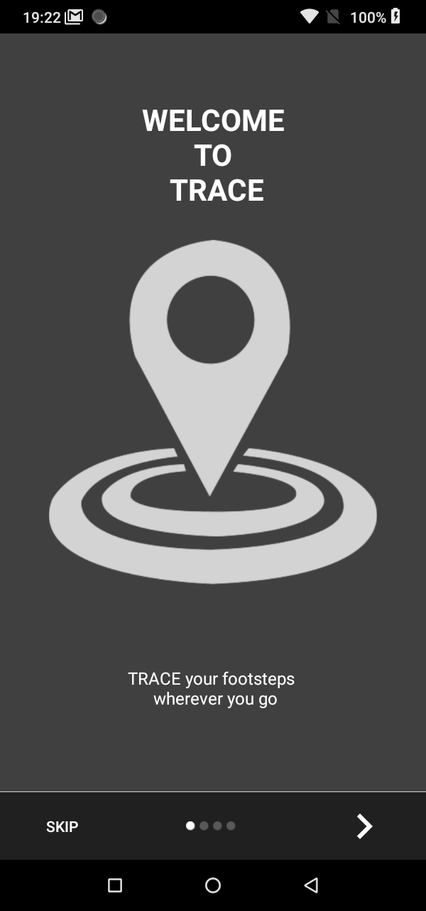
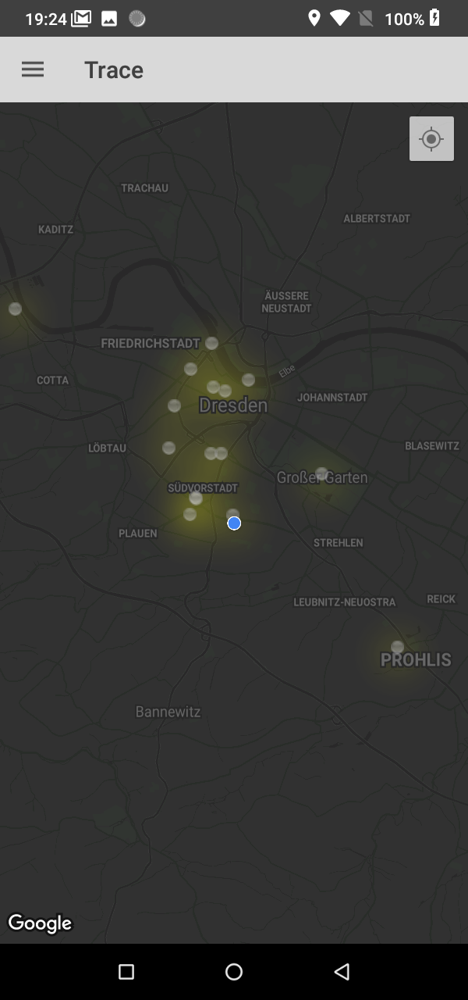
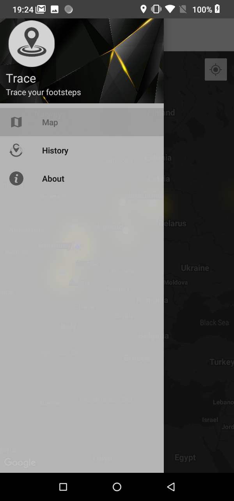
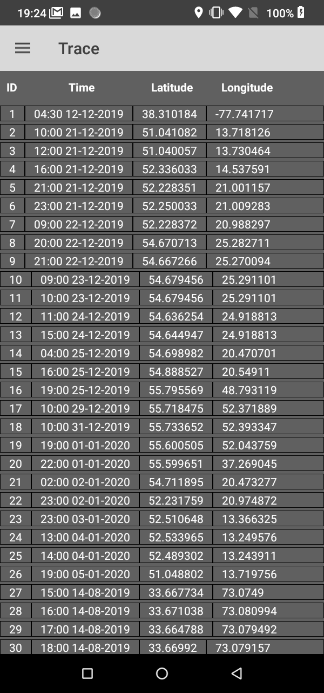
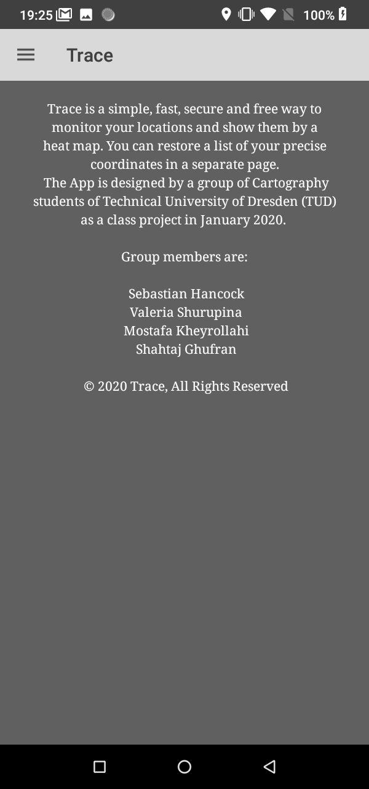
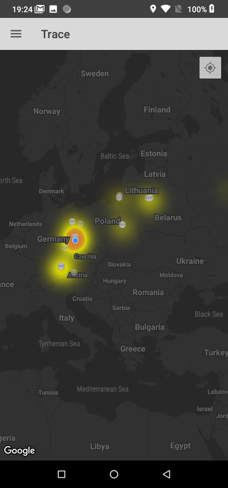

# Trace
**Trace** 
* a simple, fast, secure and free way to monitor your locations and show them by a heat map. 

**Purpose:**
* Provide a collection of location history to users as a personal map.

**How it works:**
* Collects the location data of the user
* Adds it to a database
* Creates a heat map of the locations collected
* Works as a log of the user’s locations.

**Target Audience:**
* Travellers, 
* Students, 
* Anyone who wants to keep a log of their location history :)

## Screenshots
   

     

  

  

## Credits
The App is designed by a group of Cartography students of Technical University of Dresden (TUD) as a class project in January 2020.

*Sebastian Hancock*

*Valeria Shurupina*

*Mostafa Kheyrollahi*

*Shahtaj Ghufran*

**© 2020 Trace, All Rights Reserved**
